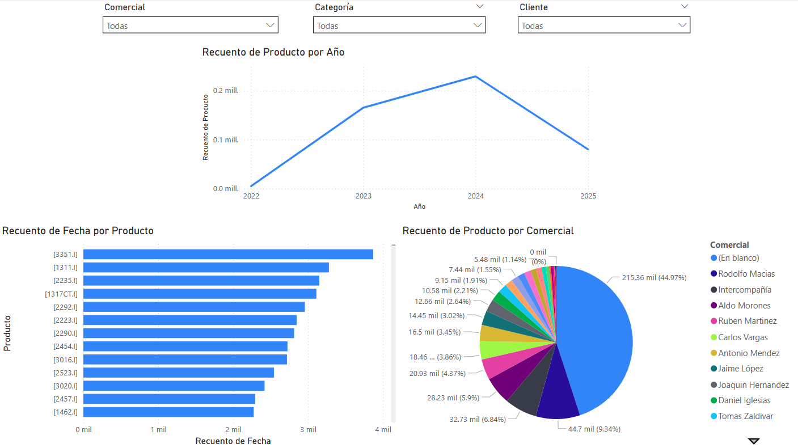
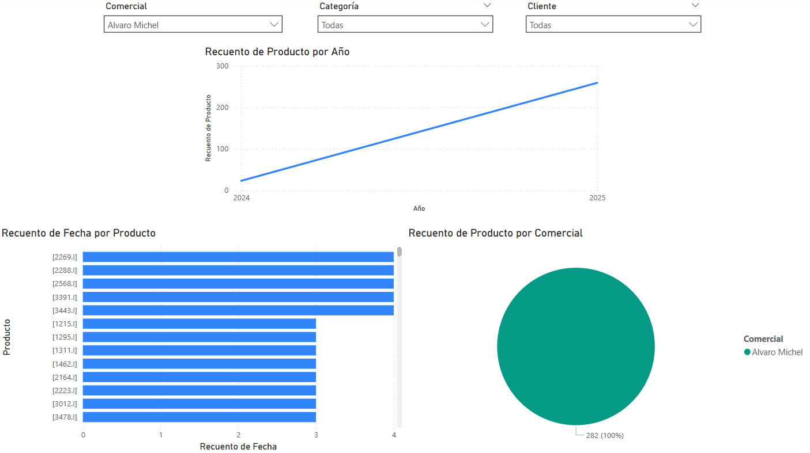
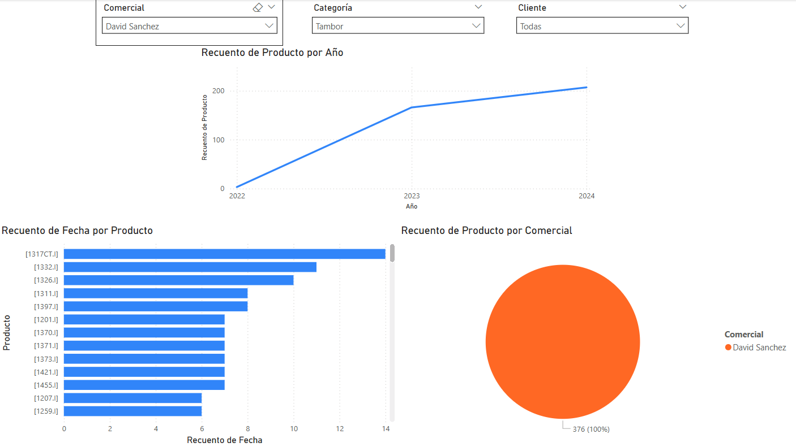

# Video Game Sales Dashboard - Power BI Project

This project showcases a Power BI dashboard built using video game sales data. It provides insights into global sales performance, platform popularity, genre trends, and publisher impact over time.

## Dataset Overview

The dataset contains information on top-selling video games from various platforms, including:

- **Game Name**
- **Platform**
- **Release Year**
- **Genre**
- **Publisher**
- **Sales by Region**: North America, Europe, Japan, Others
- **Global Sales**

Source file: `Ventas_Videojuegos.xlsx`

## Key Features

- **Top-selling games** by global sales
- **Sales trends** by year and genre
- **Platform performance** comparison
- **Regional analysis** of video game sales
- Interactive filters by platform, publisher, genre, and year

## Insights Discovered

- Nintendo dominates global sales with multiple entries in the top-selling games.
- Sports and platformer genres are historically the most profitable.
- The Wii and NES platforms had significant market impact in their peak years.
- North America consistently leads in video game consumption.

## Files

- `Ventas_Videojuegos.xlsx`: Dataset used for analysis
- `videoGamesSales.pbix`: Power BI file
- `screenshot`: gamesSales.png

## Dashboard Preview

